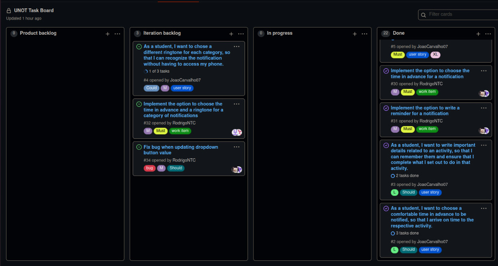

## Iteration 3

[Link for release](https://github.com/LEIC-ES-2021-22/2LEIC11T2/releases/tag/v3.0)

## Iteration retrospective meeting

## What went well?
- In this iteration we managed to implement the scraping of data that would be the foundation to get the information we needed as well as the integration with the data base and visual parts of widgets.           
- We also added the option to generate a pdf file with all the information related to exams and events, with the choice to export it to wherever we want.

## What should we do differently?
- We think that the ideal would have been to implement a database with only one relational scheme but we followed the pattern already implemented in the UNI app.
- We also believe that maybe we could have changed some functions to be reused instead of creating a lot of similar things.

## What still puzzles me?
- We had a hard time trying to understand some concepts and how they worked, like "onChange", how to change states, and some things more related to the database.
- We couldn't implement the option to enable/disable all notifications at once since it was generating some bad errors, so we made the decision to focus on other features.
## Project Board 

 

